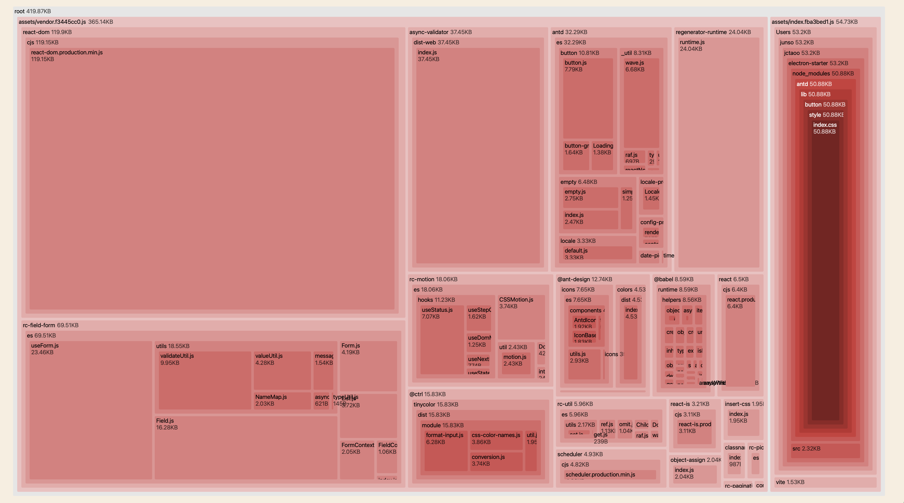

# Antd Example

see [main branch](https://github.com/jctaoo/electron-starter)

If using antd pro layout or overriding the default antd-design theme, add this option in vite.config.ts.

```typescript
export default defineConfig({
  // ...
  resolve: {
    alias: [
      { find: /^~/, replacement: "" }, // to handle webpack alias '~'
    ],
  },
  css: {
    preprocessorOptions: {
      less: {
        modifyVars: {
          // overriding the default ant-design theme.
          white: "#333",
          "component-background": "#777",
          "primary-color": "#1DA57A",
          "link-color": "#1DA57A",
          "border-radius-base": "2px",
        },
        javascriptEnabled: true, // allow using inline javascript in less file
      },
    },
  },
});
```

Related issue:

- [less preprocessors options](https://github.com/vitejs/vite/issues/332)
- [less webpack alias '~'](https://github.com/vitejs/vite/issues/2185)
- [antd-sign theme overriding](https://ant.design/docs/react/customize-theme)

Support automatic import atnd css.

## Screenshot


## rollup bundle analyzer screenshot:


