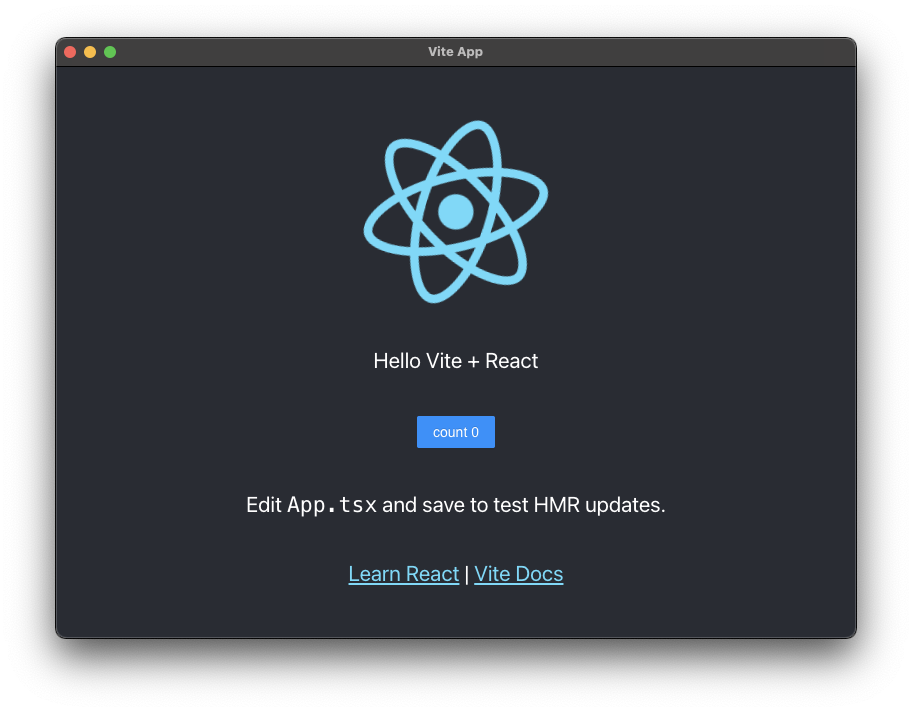

# ⚡️ vite electron starter


Electron 初始项目，使用 tsc 或 esbuild 构建主进程，使用 vite 构建渲染进程

使用 Antd 的 React demo (已配置自动样式引入, vite 默认支持按需加载): [antd branch](https://github.com/jctaoo/electron-starter/tree/antd)

注意: CSC_IDENTITY_AUTO_DISCOVERY 默认设置为 false 以避免在打包 macos 的 codesign 操作 (详见 [codesign](https://www.electron.build/code-signing))

## 使用

项目创建:

- 直接 clone 该项目
- 如果使用 GitHub，点击该页面上方的 Use this template 或[这里](https://github.com/jctaoo/electron-starter/generate) (不要勾选 include all branch)

安装依赖

```shell
yarn
```

启动本地调试

```shell
# 使用 esbuild 来编译主进程 Typescript，速度更佳
yarn run dev

# 使用 tsc 来编译主进程 Typescript
yarn run dev:tsc
```

也可以分开使用 `dev:main`, `dev:main:tsc`, `dev:renderer` 来分开调试主进程和渲染进程。

编译/打包

```shell
# 仅构建主进程和渲染进程的目标代码和资源，不打包（exe, dmg 等）
yarn run build

# 在 build 的基础上运行/预览运行效果 (production 模式)，用来本地验证
yarn run preview

# 构建并打包为可运行的程序或安装程序
yarn run pack:win
yarn run pack:mac
yarn run pack:linux

# 为所有平台打包
yarn run pack # 排除 mac 平台，适用于 linux & win
yarn run pack:all
```

清理构建目录

```shell
yarn run clean
```

## 运行截图



## 文件结构

采用 [two-package-structure](https://www.electron.build/tutorials/two-package-structure)

```
+ app                     electron-builder app 目录及其构建产物目录 (目标js代码，图片资源等等，而不是安装包或可运行文件)
  - package.json          生产依赖，全部存为 dependencies (而不是 devDependencies)
+ dist                    electron-builder 打包目录
+ scripts                 支持开发/构建等的脚本
+ src
  + common                通用代码
  + main                  主进程模块
  + renderer              渲染进程模块
- package.json            开发时依赖，全部存为 devDependencies (而不是 dependencies)
- vite.config.ts          vite 配置
- electron-builder.yml    electron-builder 配置
```
